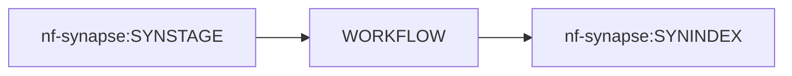

# nf-synapse

A centralized repository of Nextflow workflows that interact with [Synapse](https://www.synapse.org/).

## Purpose

The purpose of this repository is to provide a collection of Nextflow workflows that interact with Synapse by leveraging the [Synapse Python Client](https://github.com/Sage-Bionetworks/synapsePythonClient). These workflows are intended to be used in a [Seqera Platform](https://docs.seqera.io/platform/latest/) environment primarily, but they can also be executed using the [Nextflow CLI](https://nextflow.io/docs/latest/cli.html#run) on your local machine.

## Structure

This repository is organized as follows:
1. Individual process definitions, or modules, are stored in the `modules/` directory.
1. Modules are then combined into workflows, stored in the `workflows/` directory. These workflows are intended to capture the entire process of an interaction with Synapse.
1. Workflows are then imported into the `main.nf` script, and can be run only by specifying the `params.entry` parameter.

## Usage

Only one workflow can be used per `nf-synapse` run. The configuration for a workflow run will need to include which workflow you intend to use (indicated by specifying `params.entry`), along with all of the parameters required for that workflow.

In the example below, we provide the `params.entry` parameter `synstage` to indicate that we want to run the `SYNSTAGE` workflow. We also provide the `input` parameter, which is required for `SYNSTAGE`.

```
nextflow run main.nf -profile docker --entry synstage --input path/to/input.csv
```

## Meta-Usage

`nf-synapse` is designed to be used on either side of a general-purpose Nextflow Workflow to stage input files from Synapse or SevenBridges to an S3 bucket, run a workflow of your choosing, and then index the output files from the S3 bucket back into Synapse. 



See [`demo.py`](https://github.com/Sage-Bionetworks-Workflows/py-orca/blob/main/demo.py) in `Sage-Bionetworks-Workflows/py-orca` for an example of accomplishing this goal with Python code.

## Authentication

For Seqera Platform runs, you can configure your secrets using the [Tower CLI](https://help.tower.nf/23.2/cli/cli/) or the [Seqera Platform UI](https://docs.seqera.io/platform/latest). If you are running the workflow locally, you can configure your secrets within the [Nextflow CLI](https://nextflow.io/docs/latest/secrets.html).

### Synapse

All included workflows require a `SYNAPSE_AUTH_TOKEN` secret. You can generate a Synapse personal access token using [this dashboard](https://www.synapse.org/#!PersonalAccessTokens:). 

### Profiles

Current `profiles` included in this repository are:
1. `docker`: Indicates that you want to run the workflow using Docker for running process containers.
1. `conda`: Indicates that you want to use a `conda` environment for running process containers.
1. `synstage`: Indicates that you want to run the `SYNSTAGE` workflow (sets `params.entry = 'synstage'`).
1. `synindex`: Indicates that you want to run the `SYNINDEX` workflow (sets `params.entry = 'synindex'`).

# Included Workflows

## `SYNSTAGE`: Stage Synapse Files To AWS S3

### Purpose

The purpose of this workflow is to automate the process of staging Synapse and SevenBridges files to a Seqera Platform-accessible location (_e.g._ an S3 bucket). In turn, these staged files can be used as input for a general-purpose (_e.g._ nf-core) workflow that doesn't contain platform-specific steps for staging data. This workflow is intended to be run first in preparation for other data processing workflows.

### Overview

`SYNSTAGE` performs the following steps:

1. Extract all Synapse and SevenBridges URIs (_e.g._ `syn://syn28521174` or `sbg://63b717559fd1ad5d228550a0`) from a given text file.
1. Download the corresponding files from both platforms in parallel.
1. Replace the URIs in the text file with their staged locations.
1. Output the updated text file so it can serve as input for another workflow.

### Quickstart: SYNSTAGE

The examples below demonstrate how you would stage Synapse files in an S3 bucket called `example-bucket`, but they can be adapted for other storage backends.

1. Prepare your input file containing the Synapse URIs. For example, the following CSV file follows the format required for running the [`nf-core/rnaseq`](https://nf-co.re/rnaseq/latest/usage) workflow.

    **Example:** Uploaded to `s3://example-bucket/input.csv`

    ```text
    sample,fastq_1,fastq_2,strandedness
    foobar,syn://syn28521174,syn://syn28521175,unstranded
    ```

1. Launch workflow using the [Nextflow CLI](https://nextflow.io/docs/latest/cli.html#run), the [Tower CLI](https://help.tower.nf/latest/cli/), or the [Seqera Platform UI](https://docs.seqera.io/platform/latest).

    **Example:** Launched using the Nextflow CLI

    ```console
    nextflow run main.nf -profile docker --entry synstage --input path/to/input.csv
    ```

1. Retrieve the output file, which by default is stored in a `synstage/` subfolder within the parent directory of the input file. The Synapse and/or Seven Bridges URIs have been replaced with their staged locations. This file can now be used as the input for other workflows.

    **Example:** Downloaded from `s3://example-bucket/synstage/input.csv`

    ```text
    sample,fastq_1,fastq_2,strandedness
    foobar,s3://example-scratch/synstage/syn28521174/foobar.R1.fastq.gz,s3://example-scratch/synstage/syn28521175/foobar.R2.fastq.gz,unstranded
    ```

### Special Considerations for Staging Seven Bridges Files

If you are staging Seven Bridges files, there are a few differences that you will want to incorporate in your Nextflow run. 

1. You will need to configure `SB_AUTH_TOKEN` and `SB_API_ENDPOINT` secrets.
  - You can generate an authenication token and retrieve your API endpoint by logging in to the Seven Bridges portal you intend to stage files from, such as [Seven Bridges CGC](https://cgc-accounts.sbgenomics.com/auth/login). From there, click on the "Developer" dropdown and then click "Authentication Token". A full list of Seven Bridges API endpoints can be found [here](https://sevenbridges-python.readthedocs.io/en/latest/quickstart/#authentication-and-configuration)
1. When adding your URIs to your input file, SevenBridges file URIs should have the prefix `sbg://`. 
1. There are two ways to get the ID of a file in SevenBridges:
   - The first way involves logging into a SevenBridges portal, such as [SevenBridges CGC](https://cgc-accounts.sbgenomics.com/auth/login), navigating to the file and copying the ID from the URL. For example, your URL might look like this: "https://cgc.sbgenomics.com/u/user_name/project/63b717559fd1ad5d228550a0/". From this url, you would copy the "63b717559fd1ad5d228550a0" piece and combine it with the `sbg://` prefix to have the complete URI `sbg://63b717559fd1ad5d228550a0`.
   - The second way involves using the [SBG CLI](https://docs.sevenbridges.com/docs/files-and-metadata). To get the ID numbers that you need, run the `sb files list` command and specify the project that you are downloading files from. A list of all files in the project will be returned, and you will combine the ID number with the prefix for each file that you want to stage.

Note: `SYNSTAGE` can handle either or both types of URIs in a single input file.

### Parameters

Check out the [Quickstart](#Quickstart:SYNSTAGE) section for example parameter values.

- **`entry`**: (Required) The name of the workflow to run (`synstage`). This should be the name of the workflow file in the `workflows/` directory.
- **`input`**: (Required) A text file containing Synapse URIs (_e.g._ `syn://syn28521174`). The text file can have any format (_e.g._ a single column of Synapse URIs, a CSV/TSV sample sheet for an nf-core workflow).
- **`outdir`**: (Optional) An output location where the Synapse files will be staged. Currently, this location must be an S3 prefix for Nextflow Tower runs. If not provided, this will default to the parent directory of the input file.
- **`save_strategy`**: (Optional) A string indicating where to stage the files within the `outdir`. Options include:
    - `id_folders`: Files will be staged in child folders named after the Synapse or Seven Bridges ID of the file. This is the default behavior.
    - `flat`: Files will be staged in top level of the `outdir`.

### Known Limitations

- The only way for the workflow to download Synapse files is by listing Synapse URIs in a file. You cannot provide a list of Synapse IDs or URIs to a parameter.
- The workflow doesn't check if newer versions exist for the files associated with the Synapse URIs. If you need to force-download a newer version, you should manually delete the staged version.

## `SYNINDEX`: Index S3 Objects Into Synapse

### Purpose

The purpose of this workflow is to parallelize the process of indexing files in an S3 bucket into Synapse. `SYNINDEX` is intended to be used after a general-purpose (_e.g._ nf-core) workflow that doesn't contain platform-specific steps for uploading/indexing data. 

### Overview

`SYNINDEX` performs the following steps:

1. Gets the Synapse user ID for the account that provided the `SYNAPSE_AUTH_TOKEN` secret.
1. Updates or creates the `owner.txt` file in the S3 bucket to make the current user an owner.
1. Registers the S3 bucket as an external storage location for Synapse.
1. Generates a list of all of the objects in the S3 bucket to be indexed.
1. Recreates the folder structure of the S3 bucket in the Synapse project.
1. Indexes the files in the S3 bucket into the Synapse project.

### Quickstart:SYNINDEX

The examples below demonstrate how you would index files from an S3 bucket called `example-bucket` into Synapse.

1. Prepare your S3 bucket by setting the output directory of your general-purpose workflow to a Nextflow Tower S3 bucket. Ideally, you want this S3 bucket to be persistent (not a `scratch` bucket) so that your files will remain accessible indefinitely.

    **Example:** `s3://example-bucket` file structure:
    ```
    example-dev-project-tower-bucket
    ├── child_folder
    ├── test.txt
    │   ├── child_child_folder
    │   │   └── test2.txt
    │   ├── test1.txt
    ```

1. Launch workflow using the [Nextflow CLI](https://nextflow.io/docs/latest/cli.html#run), the [Tower CLI](https://help.tower.nf/latest/cli/), or the [Seqera Platform UI](https://docs.seqera.io/platform/latest).

    **Example:** Launched using the Nextflow CLI

    ```console
    nextflow run main.nf -profile docker --entry synindex --s3_prefix s3://example-bucket --parent_id syn12345678
    ```

1. Retrieve the output file, which by default is stored in a `S3://example-bucket/synindex/under-syn12345678/` in our example. This folder will contain a mapping of Synapse URIs to their indexed Synapse IDs.

### Parameters

Check out the [Quickstart](#Quickstart:SYNINDEX) section for example parameter values.

- **`entry`**: (Required) The name of the workflow to run (`synindex`). This should be the name of the workflow file in the `workflows/` directory.
- **`s3_prefix`**: (Required) The S3 URI of the S3 bucket that contains the files to be indexed.
- **`parent_id`**: (Required) The Synapse ID of the Synapse project or folder that the files will be indexed into.
- **`filename_string`**: (Optional) A string that will be matched against the names of the files in the S3 bucket. If provided, only files that contain the string will be indexed.

### Known Limitations

At present, it is not possible for `SYNINDEX` to be run outside of Nextflow Tower. This is due to AWS permissions complications. [Future work](https://sagebionetworks.jira.com/browse/IBCDPE-910) will include enabling the workflow to run on local machines/in virtual machines. 
